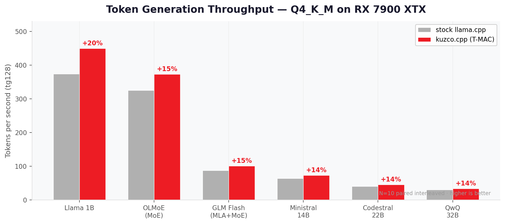
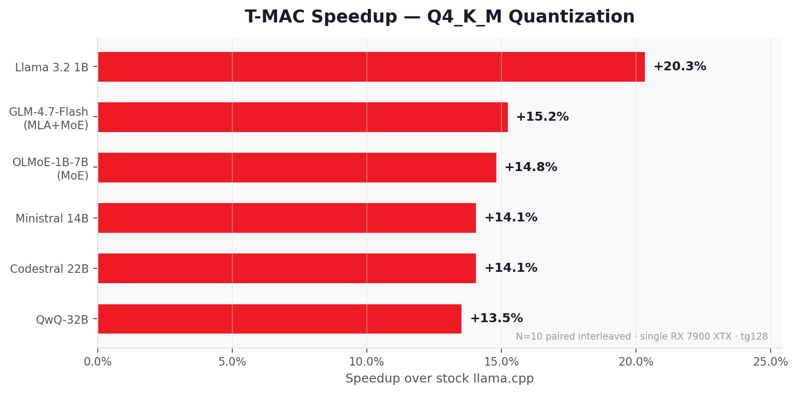
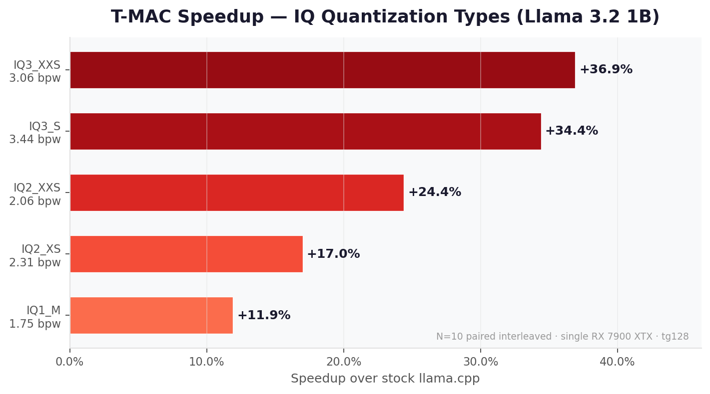
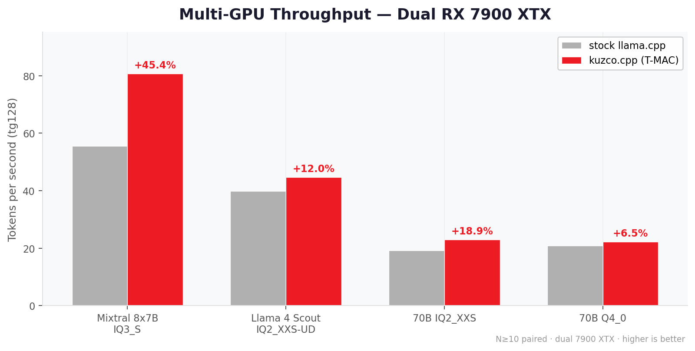

# kuzco.cpp — the fast speaking Llama!

> llama.cpp fork with T-MAC kernels for AMD RDNA3 — **+13-20% faster token generation**
> on popular quantizations, **up to +55% on MoE+IQ types** (median +14-18% across 30+ models).

<p align="center">
  
</p>

[](https://opensource.org/licenses/MIT)
[](https://github.com/nemekath/kuzco.cpp/releases)

## What is this?

[llama.cpp](https://github.com/ggml-org/llama.cpp) lets you run large language
models (LLMs) locally on your own hardware. kuzco.cpp is a fork that makes it
**faster on AMD GPUs** — specifically the RX 7900 series (RDNA3).

It replaces the inner math kernel that runs during text generation with a custom
version optimized for AMD's GPU architecture. Everything else stays the same:
same models, same output quality, same commands.

- **+13-20% faster** on Q4_K_M (most popular), up to +55% on MoE+IQ (median +14-18%)
- **Zero configuration** — auto-detects your GPU and activates automatically
- **Bit-identical output** — same quality as stock llama.cpp (perplexity delta = 0.000)
- **Safe fallback** — non-AMD hardware uses the stock kernel, nothing changes
- **31+ models tested** across 13 architecture families, including Qwen3.5 and GLM-4.7

## Performance

<p align="center">
  
</p>

> All Q4_K_M benchmarks: single AMD RX 7900 XTX, N=10 paired interleaved runs,
> 95% confidence intervals, tg128. Full data with p-values:
> [benchmarks.md](docs/tmac/benchmarks.md)

### Q4_K_M — the most popular quantization

<p align="center">
  
</p>

<details>
<summary>Exact numbers (click to expand)</summary>

| Model | Size | What it is | Stock | T-MAC | Speedup |
|-------|-----:|------------|------:|------:|--------:|
| Llama 3.2 1B | 1.24B | Small, fast model | 373 t/s | 449 t/s | **+20.3%** |
| Codestral 22B | 22.25B | Code generation | 40.0 t/s | 45.7 t/s | **+14.1%** |
| OLMoE-1B-7B | 6.92B | Mixture-of-Experts | 325 t/s | 373 t/s | **+14.8%** |
| GLM-4.7-Flash | ~16B | Mixture-of-Experts | 87.4 t/s | 100.7 t/s | **+15.2%** |
| Qwen3.5-35B-A3B | ~35B | Mixture-of-Experts | 75.0 t/s | 83.7 t/s | **+11.7%** |
| DeepSeek-V2-Lite | 16B | MoE+MLA | 155 t/s | 180 t/s | **+15.9%** |
| Qwen3.5-9B | 9B | Dense | 69.8 t/s | 77.6 t/s | **+11.1%** |
| QwQ-32B | 32B | Reasoning model | 29.9 t/s | 33.9 t/s | **+13.5%** |

</details>

### IQ types — fitting big models into less VRAM

IQ ("importance quantization") compresses models more aggressively, using fewer
**bits per weight (bpw)**. Lower bpw = smaller file = less VRAM needed, but lower
quality. This lets you run models that wouldn't otherwise fit on your GPU.

For reference: Q4_K_M uses ~4.8 bpw. IQ2_XXS uses ~2.1 bpw — less than half the
VRAM, at the cost of lower output quality.

<p align="center">
  
</p>

<details>
<summary>Exact numbers (click to expand)</summary>

| Model | Quant | bpw | VRAM savings vs Q4_K | Speedup |
|-------|-------|----:|---------------------:|--------:|
| Qwen2-57B-A14B | IQ3_XXS | 3.06 | ~36% less | **+54.5%** |
| Jamba Mini 1.7 | IQ3_XXS | 3.06 | ~36% less | **+47.2%** |
| Llama 1B | IQ3_XXS | 3.06 | ~36% less | **+36.9%** |
| Llama 1B | IQ3_S | 3.44 | ~28% less | **+34.4%** |
| OLMoE-1B-7B | IQ3_S | 3.44 | ~28% less | **+29.1%** |
| Llama 70B | IQ2_XXS | 2.06 | ~57% less | **+25.8%** |
| Llama 1B | IQ2_XXS | 2.06 | ~57% less | **+24.4%** |
| DBRX | IQ2_XXS | 2.06 | ~57% less | **+22.0%** |
| OLMoE-1B-7B | IQ2_XXS | 2.06 | ~57% less | **+18.3%** |
| Llama 1B | IQ2_XS | 2.31 | ~52% less | **+17.0%** |
| Llama 1B | IQ1_M | 1.75 | ~64% less | **+11.9%** |

</details>

**Why are IQ speedups higher?** Stock llama.cpp uses a generic lookup-table approach
for IQ types. T-MAC replaces this with an optimized implementation — the more
complex the dequantization, the more T-MAC can improve it.

### Multi-GPU (dual 7900 XTX)

Two GPUs allow running models that don't fit on a single card (e.g. Llama 70B at
~38 GB in Q4_0). T-MAC accelerates each GPU's work independently.

<p align="center">
  
</p>

<details>
<summary>Exact numbers (click to expand)</summary>

| Model | Quant | Stock | T-MAC | Speedup |
|-------|-------|------:|------:|--------:|
| Mixtral 8x7B | IQ3_S | 55.5 t/s | 80.7 t/s | **+45.4%** |
| DBRX | IQ2_XXS | 23.1 t/s | 28.2 t/s | **+22.0%** |
| Llama 70B | IQ2_XXS | 19.3 t/s | 22.9 t/s | **+18.9%** |
| Qwen2-57B-A14B | Q4_K_M | 53.7 t/s | 60.7 t/s | **+13.1%** |
| Llama 4 Scout | IQ2_XXS-UD | 39.8 t/s | 44.6 t/s | **+12.0%** |
| Llama 70B | Q4_0 | 20.8 t/s | 22.2 t/s | **+6.5%** |

</details>

> **Note:** Multi-GPU speedups vary widely by quantization type. IQ types benefit
> most because T-MAC's kernel optimization compounds with reduced synchronization
> overhead. The Mixtral result (+45.4%) combines MoE sparsity with IQ-type gains —
> single-GPU numbers are the fairer baseline for most comparisons.

<details>
<summary>Tested model architectures</summary>

T-MAC works with all major LLM architectures — not just standard transformer models:

| Architecture | Example Models | Status |
|-------------|----------------|--------|
| Dense transformer | Llama, Codestral, QwQ, Qwen3.5 | Validated |
| Mixture-of-Experts (MoE) | OLMoE, Mixtral, GLM-4.7, Qwen3.5-A3B | Validated |
| State-Space (SSM) | Mamba, Falcon H1, Jamba | Validated |
| Linear attention | RWKV-6 | Validated |
| Vision-Language (VLM) | Qwen2-VL | Validated |

23 models statistically benchmarked (N≥5, paired t-test), 31+ models tested
across 13 architecture families. Full benchmark data with confidence
intervals and p-values: [docs/tmac/benchmarks.md](docs/tmac/benchmarks.md)

</details>

## Quick Start

### Prerequisites

- AMD RDNA3 GPU (RX 7900 series validated)
- [ROCm](https://rocm.docs.amd.com/) (validated with 7.1 and 7.2; 6.x expected to work but untested)
- CMake 3.21+, C++17 compiler

### Build

```bash
git clone https://github.com/nemekath/kuzco.cpp
cd kuzco.cpp
mkdir build && cd build
cmake .. -DGGML_HIP=ON -DAMDGPU_TARGETS=gfx1100
make -j$(nproc)
```

T-MAC is enabled by default (`GGML_HIP_TMAC=ON`). No extra flags needed.

### Environment

```bash
# Exclude integrated GPU (prevents segfault on systems with iGPU)
export HIP_VISIBLE_DEVICES=0
```

### Run

```bash
# Interactive chat
./bin/llama-cli -m model.gguf -ngl 99

# Benchmark: compare T-MAC vs stock
./bin/llama-bench -m model.gguf -p 0 -n 128 -ngl 99                         # T-MAC
GGML_HIP_NO_TMAC=1 ./bin/llama-bench -m model.gguf -p 0 -n 128 -ngl 99     # Stock
```

<details>
<summary>Use with Open WebUI</summary>

[Open WebUI](https://github.com/open-webui/open-webui) provides a ChatGPT-style
web interface. kuzco.cpp includes an OpenAI-compatible API server that works out
of the box.

```bash
# 1. Start the kuzco.cpp API server
./bin/llama-server -m model.gguf -ngl 99 --port 8080

# 2. Run Open WebUI via Docker
docker run -d -p 3000:8080 \
  -e OPENAI_API_BASE_URL=http://host.docker.internal:8080/v1 \
  -e OPENAI_API_KEY=unused \
  ghcr.io/open-webui/open-webui:main
```

Then open [http://localhost:3000](http://localhost:3000) in your browser.

</details>

<details>
<summary>Use with SillyTavern</summary>

[SillyTavern](https://github.com/SillyTavern/SillyTavern) is a popular frontend
for chat and roleplay with LLMs.

1. Start the kuzco.cpp API server:
   ```bash
   ./bin/llama-server -m model.gguf -ngl 99 --port 8080
   ```
2. In SillyTavern, go to **API** → **Text Completion API** → select **llama.cpp (OAI)**
3. Set Server URL to `http://localhost:8080`

</details>

## Known Limitations

- **RDNA3 only:** Validated on RX 7900 XTX (gfx1100). Expected to work on
  7900 XT, 7800 XT, W7900 (same ISA). Not validated on RDNA4 or NVIDIA.
- **Token generation only:** T-MAC accelerates batch=1 decode (tg). Prefill
  (prompt processing) uses the stock kernel automatically — no slowdown.
- **Alignment constraints:** Some quantization types require hidden dimensions
  divisible by 256. Models with non-standard dimensions partially fall back
  to stock. Most popular models are unaffected.
- **MoE fine-grained experts:** Models with many small experts (e.g. 256 experts
  with FFN < 1024) may see reduced or no benefit on IQ/Q3 types. Dense and shared
  layers still benefit. One known regression: Hunyuan-A13B Q3_K_M (-4.9%). Use
  Q4_K_M or higher for best results on fine-grained MoE architectures.
- **Single hardware tested:** All benchmarks on RX 7900 XTX. Performance
  may vary on other RDNA3 SKUs.
- To disable T-MAC and fall back to stock kernels: `export GGML_HIP_NO_TMAC=1`

T-MAC is complementary to other AMD optimizations (Flash Attention for
prefill, composable_kernel for batched inference). It targets specifically
the single-token generation bottleneck.

<details>
<summary>Supported Quantization Types (17)</summary>

17 types supported. T-MAC activates automatically when conditions are met (RDNA3 +
batch=1 + supported type + alignment). No configuration needed — just use any
supported quantization and T-MAC takes care of the rest.

> **Which quant should I use?** Start with **Q4_K_M** — it's the best balance of
> quality, speed, and VRAM usage for most models. Only go lower (IQ3, IQ2) if your
> model doesn't fit in VRAM at Q4_K_M.

| Category | Types | Bits per weight | Use case |
|----------|-------|----------------:|----------|
| K-quants | Q3_K, Q4_K, Q5_K, Q6_K | 3.4 – 6.6 | **Recommended.** Best quality/size trade-off |
| Legacy | Q4_0, Q5_0, Q5_1, Q8_0 | 4.0 – 8.5 | Older format, still works well |
| IQ (importance) | IQ1_M – IQ4_XS (8 types) | 1.75 – 4.25 | Extreme compression for large models |
| MXFP | MXFP4 | 4.0 | OCP Microscaling format (some MoE models) |

</details>

<details>
<summary>How it Works</summary>

During token generation, the GPU spends most of its time on matrix-vector
multiplications (one token at a time). Stock llama.cpp dequantizes compressed
weights back to floating point, then multiplies. T-MAC takes a shortcut:

1. **Precomputes a lookup table** of all possible partial results in fast GPU shared memory
2. **Uses the compressed weight bits directly as table indices** — no decompression needed
3. **Accumulates the looked-up values** — skipping the expensive multiply step entirely

Additionally, T-MAC **fuses operations** that stock llama.cpp runs separately (e.g.
the gate + up projections in SwiGLU layers), cutting memory reads in half for those
layers.

The result: fewer memory reads, fewer instructions, same output. Technical
deep-dive with architecture diagrams: [TMAC.md](TMAC.md)

**Memory usage:** T-MAC uses zero additional VRAM for weight storage. Lookup
tables are built at kernel launch time in fast on-chip memory (LDS), not in
GPU VRAM.

</details>

<details>
<summary>Why does this exist?</summary>

I bought two RX 7900 XTX cards for local LLM inference and quickly noticed that
AMD gets far less optimization attention than NVIDIA in the llama.cpp ecosystem.
The CUDA backend has years of hand-tuned kernels. The HIP/ROCm backend works, but
the quantized GEMV path — the single hottest loop during text generation — was
essentially a recompiled CUDA kernel with no AMD-specific tuning. Dual-GPU setups
were even more neglected.

I wanted to know: how much performance is being left on the table? Not as a
theoretical exercise, but as an actual measured answer with real models and
real workloads.

Turns out: 10-37%, depending on model and quantization. That's not a rounding
error. That's hundreds of tokens per second on everyday models.

This project started from curiosity and the simple joy of making something faster.
I'm not a GPU kernel engineer by trade — I'm a developer who likes to understand
how things work at the hardware level. The fact that I used AI tools (Claude and
Gemini) to build this is not something I'm hiding; it's part of the story. The
AI helped me explore RDNA3's memory hierarchy, prototype kernel variants, and
run systematic experiments faster than I could alone. Every result is backed by
reproducible benchmarks with raw data — you don't have to trust me or the AI,
you can [verify it yourself](#reproducing-results).

kuzco.cpp is not a replacement for llama.cpp. It's a specialization that targets
one specific bottleneck on one specific GPU family. Everything else — the model
loading, the sampling, the chat interface — that's all llama.cpp, and it's
excellent.

**Why a fork (and not a PR)?** llama.cpp's contribution policy does not accept
AI-generated code. I respect that boundary. Rather than obscuring how this was
built, I chose transparency: an independent fork with monthly rebase against
upstream.

**Acknowledgments.** Built on [llama.cpp](https://github.com/ggml-org/llama.cpp)
by Georgi Gerganov and
[contributors](https://github.com/ggml-org/llama.cpp/graphs/contributors).
The [ggml](https://github.com/ggml-org/ggml) tensor library makes all of this
possible.

</details>

<details>
<summary>Reproducing Results</summary>

Don't take our word for it — verify on your own hardware:

```bash
# Download any supported model
huggingface-cli download bartowski/Llama-3.2-1B-Instruct-GGUF \
  --include "Llama-3.2-1B-Instruct-Q4_K_M.gguf" --local-dir models/

# Run paired benchmark (N=5, ~10 minutes)
scripts/reproduce-benchmarks.sh models/Llama-3.2-1B-Instruct-Q4_K_M.gguf
```

Outputs a CSV with raw per-run data and a summary with speedup + 95% confidence interval.
Raw data from our measurements: [`data/benchmarks/`](data/benchmarks/)

</details>

<details>
<summary>Relationship to Upstream</summary>

- **Independent fork** with monthly rebase against [ggml-org/llama.cpp](https://github.com/ggml-org/llama.cpp) master
- T-MAC files (`tmac.cu`, `tmac.cuh`) are **self-contained** — they don't exist upstream
- Dispatch sites in `ggml-cuda.cu` and `mmvq.cu` are marked with `// ── T-MAC dispatch site N/6 ──` for easy conflict resolution during rebase
- **All upstream functionality is preserved** — T-MAC is purely additive
- Non-RDNA3 hardware is completely unaffected

</details>

## Documentation

| Document | Contents |
|----------|----------|
| [TMAC.md](TMAC.md) | Technical architecture, kernel design, dispatch flow |
| [docs/tmac/benchmarks.md](docs/tmac/benchmarks.md) | Full benchmark suite with CIs and p-values |
| [CONTRIBUTING.md](CONTRIBUTING.md) | How to contribute, report bugs, testing requirements |
| [CHANGELOG.md](CHANGELOG.md) | Version history |

## License

MIT — same as [upstream llama.cpp](https://github.com/ggml-org/llama.cpp).
